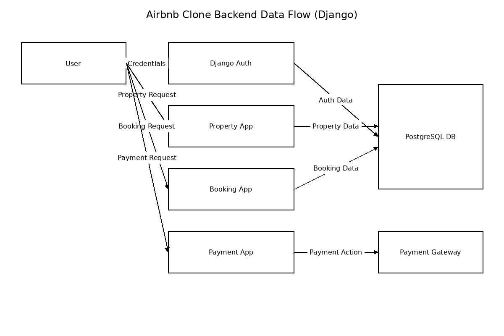

# Data Flow Diagram

This directory contains the Data Flow Diagram (DFD) for the Airbnb Clone Backend, illustrating how data moves through the system when built with Django.

**data-flow.png**: PNG export of the DFD, showing:

* **User** interactions with Django Auth, Property, Booking, and Payment apps.
* Data storage in **PostgreSQL DB**.
* External **Payment Gateway** for transaction processing.
