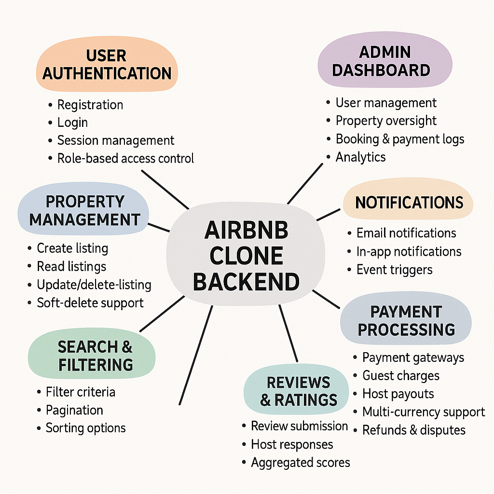

# AirBnB Clone – Features and Functionalities

## Objective

This document identifies and summarizes the **key features and functionalities** required for the **Airbnb Clone backend** project. It is based on the official ALX SE project requirements, focusing on core modules such as user management, property listings, bookings, payments, and more.

A visual overview is included in `airbnb-backend-features.png`.

## Core Functionalities

### 1. User Management

- **User Registration**
  - Allow users to register as either **guest** or **host**
  - Use secure password hashing and JWT session management

- **Authentication**
  - Email and password login
  - OAuth login via Google or Facebook (optional)

- **Profile Management**
  - Edit profile details, contact info, and photo upload

### 2. Property Listings Management

- **Create Listings**
  - Hosts can add property title, description, location, price, amenities, and availability

- **Edit/Delete Listings**
  - Hosts can update or remove their listings

### 3. Search and Filtering

- **Search Capabilities**
  - Find listings by location, price range, number of guests, and amenities

- **Pagination**
  - Efficient browsing through paginated search results

### 4. Booking Management

- **Create Bookings**
  - Guests can book a listing for specified dates
  - Prevent double-booking via availability validation

- **Booking Cancellation**
  - Guests or hosts can cancel bookings based on policy

- **Booking Status Tracking**
  - Status flow: `pending → confirmed → canceled / completed`

### 5. Payment Integration

- **Secure Payments**
  - Collect guest payments via **Stripe** or **PayPal**

- **Host Payouts**
  - Automate host payouts after booking completion

- **Multi-Currency Support**
  - Enable international transactions

### 6. Reviews and Ratings

- **Guest Reviews**
  - Submit ratings and feedback after confirmed stays

- **Host Replies**
  - Hosts may respond to reviews

- **Booking Validation**
  - Prevent reviews without associated bookings

### 7. Notifications System

- **Email & In-App Notifications**
  - Booking confirmations, payment updates, cancellations

### 8. Admin Dashboard

- Admin panel to view and manage:
  - All users
  - Property listings
  - Booking records
  - Payment logs

## Technical Requirements

### 1. Database Management

- Use **PostgreSQL** or **MySQL**
- Key tables:
  - `users`, `properties`, `bookings`, `payments`, `reviews`

### 2. API Development

- Build RESTful APIs:
  - Support `GET`, `POST`, `PUT/PATCH`, `DELETE`
- (Optional) Add GraphQL for advanced queries

### 3. Authentication & Authorization

- Use **JWT** for stateless sessions
- Implement **Role-Based Access Control (RBAC)** for guests, hosts, and admins

### 4. File Storage

- Store profile photos and property images
- Use cloud services like **AWS S3** or **Cloudinary** (or local file storage for testing)

### 5. Third-Party Services

- Integrate email services (e.g., **SendGrid**, **Mailgun**)

### 6. Error Handling and Logging

- Implement global error handlers
- Use logs to trace server issues and API errors

## Non-Functional Requirements

### 1. Scalability

- Use modular architecture for maintainability
- Enable horizontal scaling with load balancers

### 2. Security

- Encrypt sensitive data
- Use firewalls and rate limiting
- Sanitize all user input

### 3. Performance Optimization

- Use **Redis** for caching frequently accessed data
- Optimize SQL queries to reduce latency

### 4. Testing

- Write unit and integration tests (e.g., using `pytest`)
- Automate API testing

## Diagram

> Refer to the visual map:  
> 
