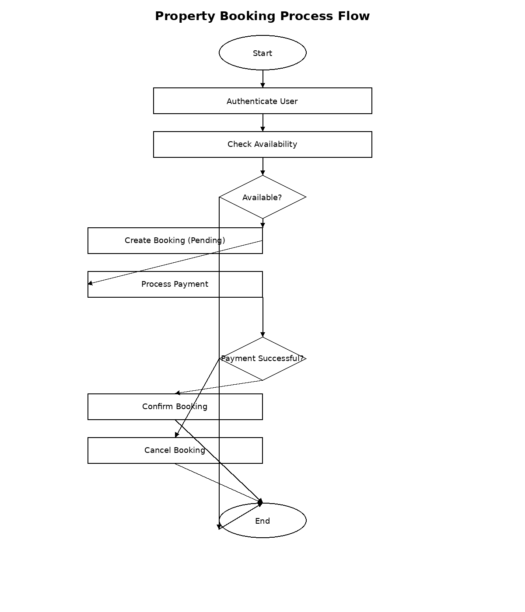

# Property Booking Process & Data Flow

This directory contains the Property Booking Process Flowchart, illustrating the steps and data flows for the booking workflow in the Airbnb Clone Backend.

**data-flow-diagram.png**: PNG export of the flowchart, showing:

* **Guest** initiates a booking request and flows through authentication.
* **Booking Service** checks availability via **Availability Service** and stores pending bookings in **Booking DB**.
* **Payment Service** processes payments through the external **Payment Gateway**.
* **Notification Service** sends booking confirmations to users.
* Data movement between services and external systems is clearly mapped for each step.
