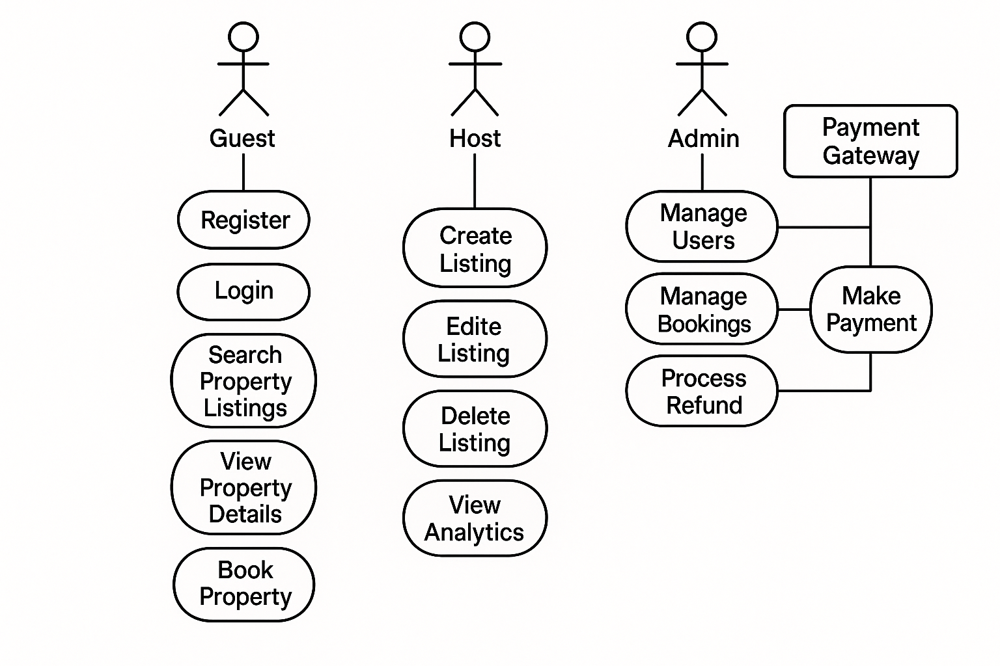

# Use Case Diagram

This directory contains the Use Case Diagram for the Airbnb Clone Backend, illustrating how different actors interact with the system’s core functionalities.

**use-case-diagram.png**: Visual diagram highlighting:

* **Actors**: Guest, Host, Admin, and external Payment Gateway.
* **Use Cases**:

  * **Registration & Authentication**: Register, Login, Logout.
  * **Property Booking**: Search Listings, View Details, Book, Cancel.
  * **Listing Management**: Create, Update, Delete Listings.
  * **Payments**: Make Payment, Process Refund (via Payment Gateway).
  * **Reviews & Ratings**: Leave Review, Respond to Review.
  * **Admin Operations**: Manage Users, Listings, Bookings, Analytics.

## Usage

Open the `use-case-diagram.png` file to visualize the system interactions and user journeys through the backend services.
